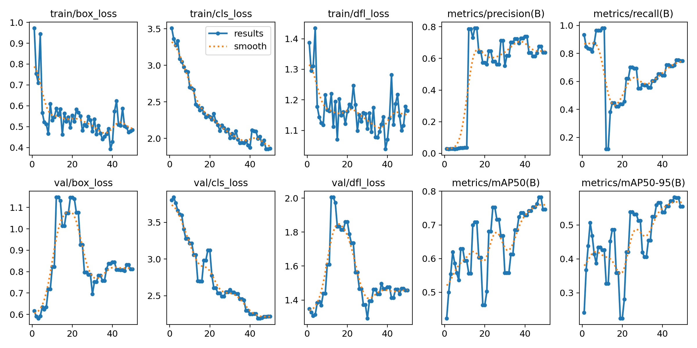
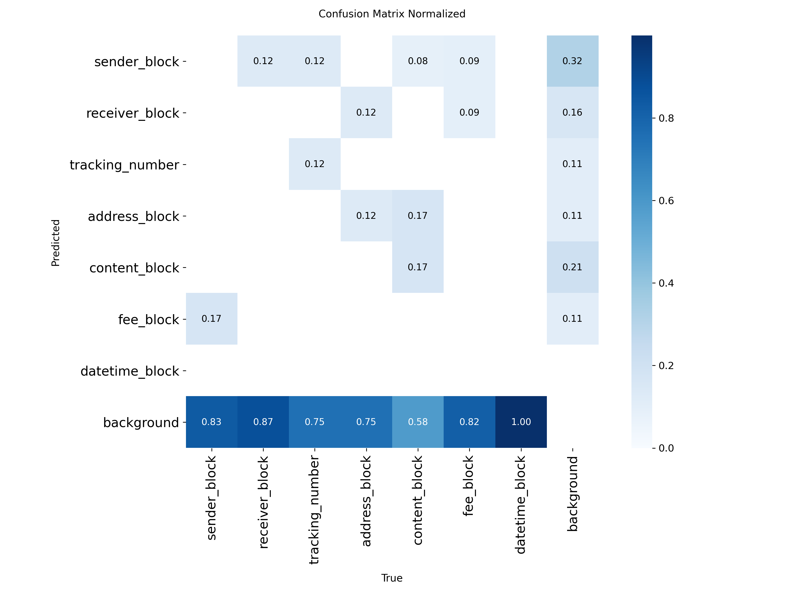
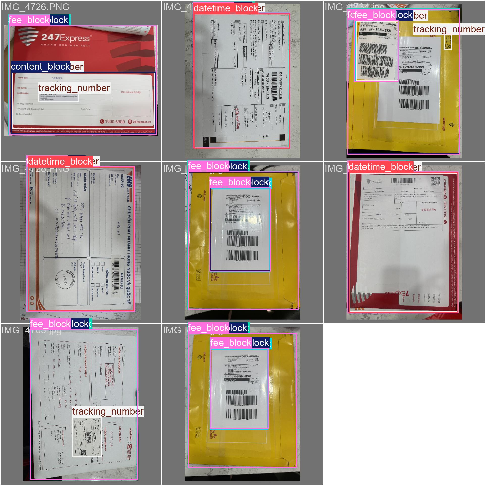
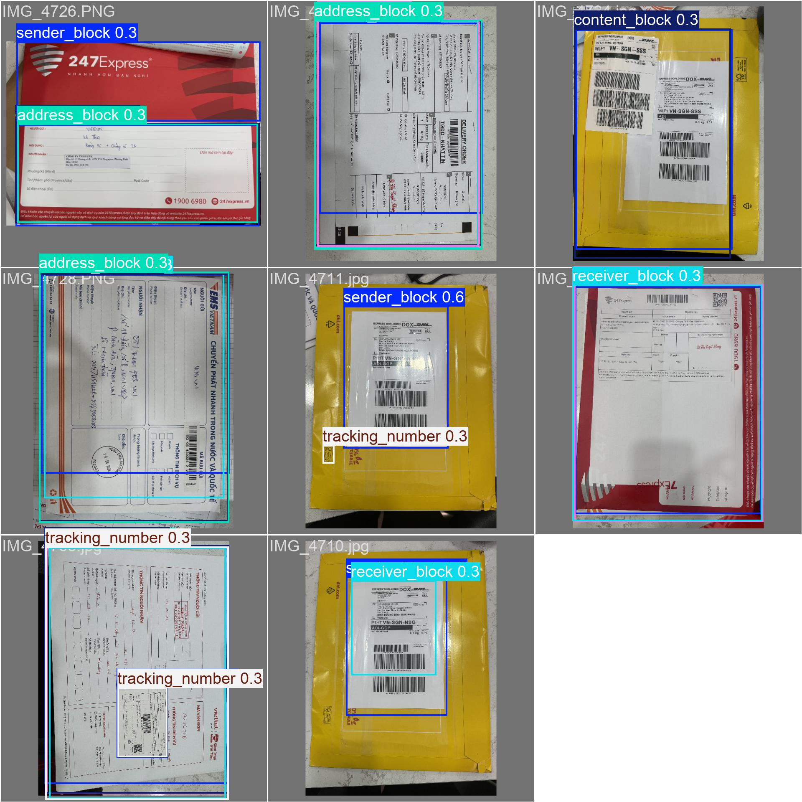
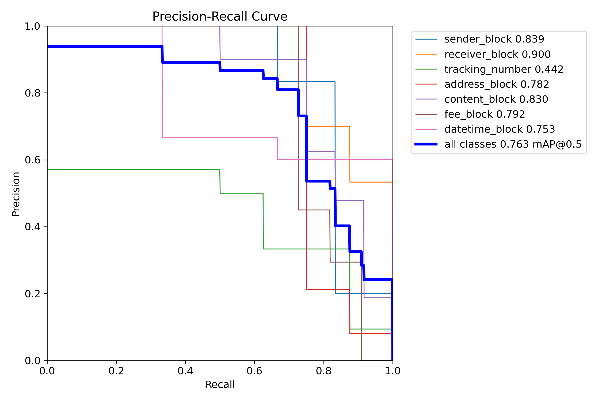

# Letter Model — Nhận dạng phiếu gửi hàng tự động

Pipeline 5 bước xử lý ảnh phiếu gửi hàng Việt Nam: phát hiện vùng → OCR → trích xuất trường thông tin → xuất Google Sheets + Email thông báo.

---

## Kiến trúc pipeline

```
Ảnh phiếu (HEIC/PNG/JPG)
        │
        ▼
[1] Tiền xử lý       ← load_and_prepare() — resize, normalize
        │
        ▼
[2] Phát hiện vùng   ← YOLOv8n fine-tuned — 7 classes
        │
        ▼
[3] OCR từng vùng    ← EasyOCR (vi + en)
        │
        ▼
[4] Trích xuất field ← GPT-4o mini — 16 trường JSON
        │
        ▼
[5] Xuất kết quả     ← Google Sheets append + Gmail notification
```

### 7 classes YOLO

| ID | Class | Mô tả |
|----|-------|-------|
| 0 | `sender_block` | Thông tin người gửi |
| 1 | `receiver_block` | Thông tin người nhận |
| 2 | `tracking_number` | Mã vận đơn / barcode |
| 3 | `address_block` | Địa chỉ giao hàng |
| 4 | `content_block` | Nội dung hàng hóa |
| 5 | `fee_block` | Phí / tiền thu hộ |
| 6 | `datetime_block` | Ngày giờ gửi |

---

## Kết quả training YOLOv8

**Dataset:** 41 ảnh thực tế (33 train / 8 val) — auto-labeled bằng Grounding DINO

| Metric | Giá trị |
|--------|---------|
| mAP@50 | **0.782** |
| mAP@50-95 | **0.580** |
| Precision | 0.676 |
| Recall | 0.752 |
| Epochs | 50 |
| Model | YOLOv8n (3M params) |

### Training curves



### Confusion matrix (normalized)



### Val — Ground truth vs Predictions

| Ground Truth | Predictions |
|:---:|:---:|
|  |  |

### PR Curve



---

## Ví dụ đầu ra

Input: ảnh phiếu Viettel Post `IMG_4725.PNG`

```json
{
  "don_vi_van_chuyen": "Viettel Post",
  "ma_van_don": "138963567225",
  "nguoi_gui": "CÔNG TY CỔ PHẦN THƯƠNG MẠI BƯU CHÍNH VÀ CHUYỂN PHÁT NHANH VIỆT",
  "sdt_gui": "081****600",
  "dia_chi_gui": "A75/16 Bạch Đằng P 02, P.2, Q.Tân Bình, TP.Hồ Chí Minh",
  "nguoi_nhan": "thanh thảo - Công ty FES VN",
  "sdt_nhan": "098****412",
  "dia_chi_nhan": "Số 11 - Đường Số 8 - Kcn Vsip, P.Bình Hòa, Thuận An",
  "tinh_tp_nhan": "BÌNH DƯƠNG",
  "quan_huyen_nhan": "THUẬN AN",
  "phuong_xa_nhan": "BÌNH HÒA",
  "noi_dung_hang_hoa": "1 x giấy tờ",
  "trong_luong": "0.05",
  "tien_thu_ho": "55.000",
  "ngay_gio_gui": "08/04/2026 15:00:53",
  "loai_dich_vu": "TIẾT KIỆM / NỘI MIỀN / TTKT3",
  "trang_thai": "Pending"
}
```

---

## Cấu trúc dự án

```
mail-ocr-ner/
├── src/
│   ├── preprocessing.py      # Load ảnh, resize, normalize
│   ├── detect_regions.py     # YOLOv8 detect + train wrapper
│   ├── ocr_regions.py        # EasyOCR từng vùng
│   ├── extract_info.py       # GPT-4o mini → JSON fields
│   ├── export.py             # Google Sheets + Gmail
│   ├── auth_google.py        # OAuth2 / Service Account helper
│   ├── label_with_vision.py  # GPT-4o Vision batch labeling
│   ├── auto_bbox.py          # Grounding DINO → YOLO labels
│   └── pipeline.py           # Orchestrator 5 bước
├── backend/
│   ├── main.go               # Go HTTP server
│   └── sheets.go             # /api/confirm-received endpoint
├── tests/                    # 30 unit tests (pytest)
├── data/
│   ├── labels/               # JSON ground truth (GPT-4o Vision)
│   └── yolo_dataset/         # train/val split + data.yaml
├── assets/                   # Ảnh kết quả training
├── setup_auth.py             # One-time Google OAuth setup
└── requirements.txt
```

---

## Setup & Cài đặt

### Yêu cầu

- Python 3.12
- Git

### 1. Clone và tạo môi trường ảo

```bash
git clone https://github.com/YaoMing-dev/Letter_Model.git
cd Letter_Model
python -m venv .venv312
```

Windows:
```bash
.venv312\Scripts\activate
```

Linux/Mac:
```bash
source .venv312/bin/activate
```

### 2. Cài đặt dependencies

```bash
pip install -r requirements.txt
```

> **Lưu ý:** EasyOCR sẽ tự download model tiếng Việt (~200MB) lần đầu chạy.

### 3. Cấu hình biến môi trường

Tạo file `.env` tại root:

```env
OPENAI_API_KEY=sk-...
GOOGLE_SHEET_ID=<sheet_id>
GOOGLE_CREDENTIALS_FILE=credentials.json
GOOGLE_TOKEN_FILE=token.json
CONFIRM_BASE_URL=http://localhost:8080
SMTP_HOST=smtp.gmail.com
SMTP_PORT=587
SMTP_USER=your@gmail.com
SMTP_PASSWORD=<app_password>
NOTIFY_EMAIL=your@gmail.com
```

### 4. Cấp quyền Google Sheets (lần đầu)

Tải `credentials.json` (OAuth Desktop App) từ Google Cloud Console rồi chạy:

```bash
python setup_auth.py
```

Trình duyệt sẽ mở → Đăng nhập → Allow. Token lưu tại `token.json`.

### 5. Chạy pipeline

```bash
python -m src.pipeline <đường_dẫn_ảnh> \
  --yolo_model runs/detect/models/yolo_regions/phieu_gui_v1/weights/best.pt
```

---

## Training lại YOLO

### Bước 1 — Tạo ground truth labels bằng GPT-4o Vision

```bash
python src/label_with_vision.py \
  --img_dir data/raw_images \
  --out_dir data/labels \
  --delay 0.5
```

### Bước 2 — Auto-label bounding boxes bằng Grounding DINO

```bash
python src/auto_bbox.py \
  --img_dir data/raw_images \
  --out_dir data/yolo_dataset \
  --val_ratio 0.2
```

### Bước 3 — Train YOLOv8

```bash
python src/detect_regions.py train \
  --data data/yolo_dataset/data.yaml \
  --epochs 50 \
  --batch 4 \
  --imgsz 640
```

---

## Backend Go (xác nhận nhận hàng)

```bash
cd backend
go build -o mail-ocr-backend .
./mail-ocr-backend
```

Endpoint `GET /api/confirm-received?id=<ma_van_don>` cập nhật cột trạng thái trong Google Sheet.

---

## Tests

```bash
python -m pytest tests/ -v
```

30 tests — preprocessing, YOLO detect/train, OCR regions, field extraction, Sheets export, email notification.

---

## Stack

| Thành phần | Công nghệ |
|------------|-----------|
| Region detection | YOLOv8n (ultralytics) |
| Auto-labeling bbox | Grounding DINO (transformers) |
| OCR | EasyOCR (PyTorch) |
| Field extraction | GPT-4o mini (OpenAI) |
| Ground truth labeling | GPT-4o Vision |
| Google Sheets | gspread + OAuth2 |
| Email | smtplib + Gmail App Password |
| Backend | Go 1.22 |
| Image formats | HEIC, PNG, JPG (pillow-heif) |
